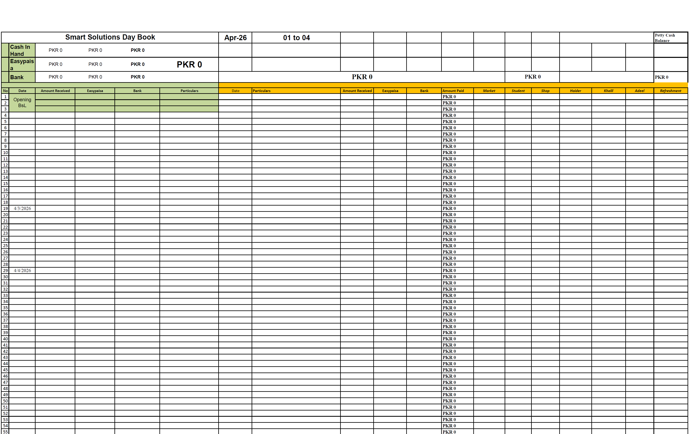
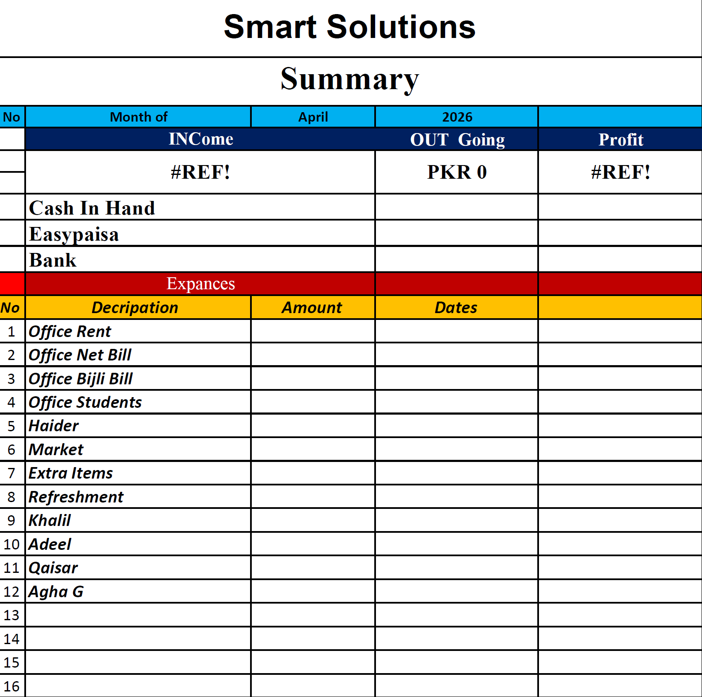
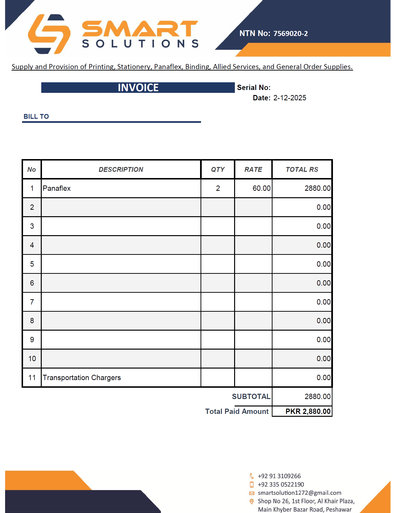

# Smart Solutions — Record Keeping App

> **Production WPF desktop application** built for Smart Solutions, Peshawar (NTN: 7569020-2) — a printing and Haier AC after-sales service business.
> Designed and developed using an AI-assisted engineering workflow with **Claude Code** — specification-driven design, architecture review, implementation, testing, and deployment — by a software engineer with 20+ years of experience.

[](https://dotnet.microsoft.com/)
[](https://learn.microsoft.com/en-us/dotnet/desktop/wpf/)
[](https://materialdesigninxaml.net/)
[](https://www.microsoft.com/en-us/sql-server/)
[](https://learn.microsoft.com/en-us/windows/msix/)
[](https://claude.ai/code)

---

## The Problem It Solves

Smart Solutions was tracking print orders, Haier AC jobs, and business finances using Excel spreadsheets and manually generated invoices:

<table>
<tr>
<td></td>
<td></td>
<td></td>
</tr>
<tr>
<td align="center"><em>Daily transaction log in Excel</em></td>
<td align="center"><em>Monthly income/expense summary</em></td>
<td align="center"><em>Manually generated invoice</em></td>
</tr>
</table>

Manual, error-prone, impossible to audit, and not shareable across multiple PCs. This app replaces the entire workflow with a validated, guided, multi-user desktop application.

---

## What It Does

### Print Business
- **Print Orders** — customers, multi-line orders with per-sqft and per-piece pricing, vendor assignment, status tracking (Draft → Confirmed → Sent to Vendor → Ready → Delivered)
- **PDF Invoices** — generated from a FastReport template with business letterhead
- **Partial Payments** — collect payments over time; balance = total invoiced − sum of payments

### Haier AC After-Sales Service
- **Haier Jobs** — warranty and out-of-warranty repair jobs, technician assignment, job status tracking (Pending → In Progress → Completed)
- **Job Payments** — same partial payment model as print orders

### Business Operations
- **Expenses** — categorised expense tracking with payment channel breakdown (Cash, Easypaisa, Bank, etc.)
- **Financial Reports** — income, expense, and profit summaries by date range
- **Customer Management** — searchable customer list with contact and address details
- **Audit Trail** — every record stamped with the creating user; full accountability without complex permissions

### Setup & Deployment
- **First-Run Wizard** — guided 3-step setup (database connection → business info → admin PIN) on first launch
- **Multi-PC LAN** — each PC has its own `appsettings.json`; all connect to a shared SQL Server on the LAN
- **MSIX Installer** — distributed as a signed `.msix` package for clean Windows installation

### Lookup Data (all user-managed, nothing hardcoded)
Item categories, item names, vendors, technicians, expense categories, payment channels, and user accounts — all managed via dedicated sidebar pages. No hardcoded lists anywhere.

---

## Tech Stack

| Component | Technology |
|-----------|-----------|
| Runtime | .NET 10, C# |
| UI Framework | WPF + XAML |
| MVVM | CommunityToolkit.Mvvm |
| Database | SQL Server Express 2022 |
| ORM | Entity Framework Core 10 (code-first, migrations) |
| UI Theme | MaterialDesignInXamlToolkit |
| PDF / Print | FastReport Community |
| Packaging | MSIX (single-project) |
| Tests | xUnit + NSubstitute + FluentAssertions |

---

## Architecture

Three-layer separation — no business logic in the UI layer, no EF in the business layer:

```
SmartSolutions.Data      16 entities · EF Core migrations · AppDbContext
SmartSolutions.Core       8 services · 10 interfaces · all business logic
SmartSolutions.App       19 ViewModels · 17 Views · Material Design UI · FastReport templates
SmartSolutions.Tests     35 unit tests · NSubstitute mocks · in-memory DB
```

**Key patterns:**
- MVVM strictly enforced — `[ObservableProperty]` and `[RelayCommand]` from CommunityToolkit; no business logic in code-behind
- `IDbContextFactory<AppDbContext>` on every service — no shared singleton DbContext, safe for async
- `ISessionService` singleton — holds the logged-in user in memory for audit trail stamping
- All database calls are async — no `.Result` or `.Wait()` anywhere

---

## Engineering Workflow

This project was built using a structured, specification-driven engineering workflow, with Claude Code as an AI pair-programming accelerator:

1. **Requirements** — business problem captured as a structured Product Requirements Document
2. **Architecture & design specs** — each feature designed and reviewed before any code was written
3. **Implementation plans** — detailed, task-by-task plans reviewed and confirmed
4. **Implementation** — built incrementally, reviewed at every milestone
5. **Testing** — 35-test xUnit suite (services, validation, connection handling) kept green throughout
6. **Deployment** — MSIX packaging, first-run wizard, per-PC LAN configuration

The full paper trail is in this repo — every decision documented before it was built:

| Artifact | Link |
|----------|------|
| Product Requirements Document | [`docs/PRD.md`](docs/PRD.md) |
| Auth & Startup Design | [`docs/superpowers/specs/2026-06-10-auth-startup-design.md`](docs/superpowers/specs/2026-06-10-auth-startup-design.md) |
| MSIX & First-Run Wizard Design | [`docs/superpowers/specs/2026-06-10-msix-firstrun-design.md`](docs/superpowers/specs/2026-06-10-msix-firstrun-design.md) |
| Full App Implementation Plan | [`docs/superpowers/plans/2026-06-09-smart-solutions-full-app.md`](docs/superpowers/plans/2026-06-09-smart-solutions-full-app.md) |
| Management Pages Plan | [`docs/superpowers/plans/2026-06-10-dedicated-management-pages.md`](docs/superpowers/plans/2026-06-10-dedicated-management-pages.md) |

> Designed and built by a software engineer with 20+ years of experience, using Claude Code as a development accelerator — going from idea to production-ready app with every spec reviewed and approved before a line of code was written.

---

## Getting Started

See [`docs/INSTALL.md`](docs/INSTALL.md) for full setup instructions including MSIX certificate install and the first-run wizard walkthrough.

**Prerequisites:**
- Windows 10 / 11
- SQL Server Express 2022 (on one PC on the LAN)
- .NET 10 Desktop Runtime
